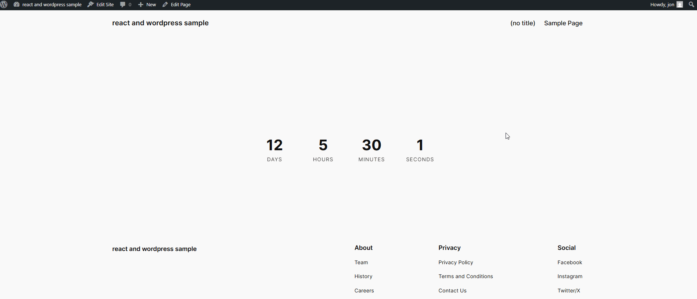

# WP React Countdown Timer

A modern, customizable countdown timer WordPress plugin built with React.  
Easily add a countdown to any page or post using a shortcode, and redirect users when the timer ends or when they click the page. This is a great component for a "splash page" when you want to build up some suspense for a new release on your homepage (or any other page).

This project also serves as a good boilerplate or starting point to create your own WordPress plugin(s) using React!


---

## Features

- **Modern React UI**: Built with React and Vite for fast development and modern code.
- **Easy Setup**: Configure the countdown target date and redirect URL from the WordPress admin.
- **Shortcode**: Add the timer anywhere with `[wp_countdown_timer]`.
- **Automatic & Manual Redirect**: Redirects when the timer ends, or when the user clicks anywhere on the page.
- **Customizable**: Style the timer via CSS.

---

## Getting Started (GitHub)

You can use this project by cloning or downloading it from GitHub. After downloading, you **must build the plugin assets** before activating it in WordPress.

### 1. Clone or Download

Clone this repository into your WordPress `wp-content/plugins` directory:

```sh
cd /path/to/your/wordpress/wp-content/plugins
# Clone via HTTPS:
git clone https://github.com/yourusername/wp-react-countdown.git
# OR download and extract the ZIP from GitHub
```

### 2. Install Dependencies

Navigate into the plugin directory and install dependencies:

```sh
cd wp-react-countdown
npm install
```

### 3. Build the React App

Build the production assets:

```sh
npm run build
```

This will generate the production assets in the `dist/` folder, which are required for the plugin to work in WordPress.

### 4. Activate the Plugin

Go to your WordPress admin panel, then **Plugins > Installed Plugins** and activate "WP Countdown Timer":


---

## Usage

1. **Configure the Countdown**

   - Go to **Countdown Timer** in the WordPress admin sidebar.
   - Set the **Target Date** and **Redirect URL**.
   - Click **Save Changes**.

   

2. **Add the Shortcode**

   - Edit any post or page and add the shortcode:

     ```
     [wp_countdown_timer]
     ```

   

3. **View the Countdown**

   - Visit the page/post. The countdown will display and redirect when finished, or when the user clicks anywhere on the page (except links, buttons, or inputs).

---

## Demo

**Countdown in action:**


**Clicking anywhere on the page triggers the redirect:**



---

## Customization

- **Styling**: Edit `src/CountdownTimer.css` to change the appearance.
- **React Component**: The main logic is in `src/CountdownTimer.jsx`.

---

## Development

- **Start Dev Server** (for live reload):

  ```sh
  npm run dev
  ```

- **Build for Production**:

  ```sh
  npm run build
  ```

- **Watch for Changes**:

  ```sh
  npm run watch
  ```

---

## Project Structure

```
wp-react-countdown/
├── dist/                  # Production build output
├── node_modules/
├── src/
│   ├── CountdownTimer.jsx # React component
│   ├── CountdownTimer.css # Styles
│   └── main.jsx           # React entry point
├── package.json
├── vite.config.js
├── wp-countdown-timer.php # Main WordPress plugin file
├── activate-plugin.PNG
├── settings-page.PNG
├── shortcode.PNG
├── countdown-example.gif
├── countdown-click-example.gif
```

---

## Credits

Created by [Jon Jackson](https://blogs.perficient.com/2025/05/14/building-a-wordpress-plugin-with-react-step-by-step-guide/).

For a detailed step-by-step guide, see the [original blog post](https://blogs.perficient.com/2025/05/14/building-a-wordpress-plugin-with-react-step-by-step-guide/).

---
